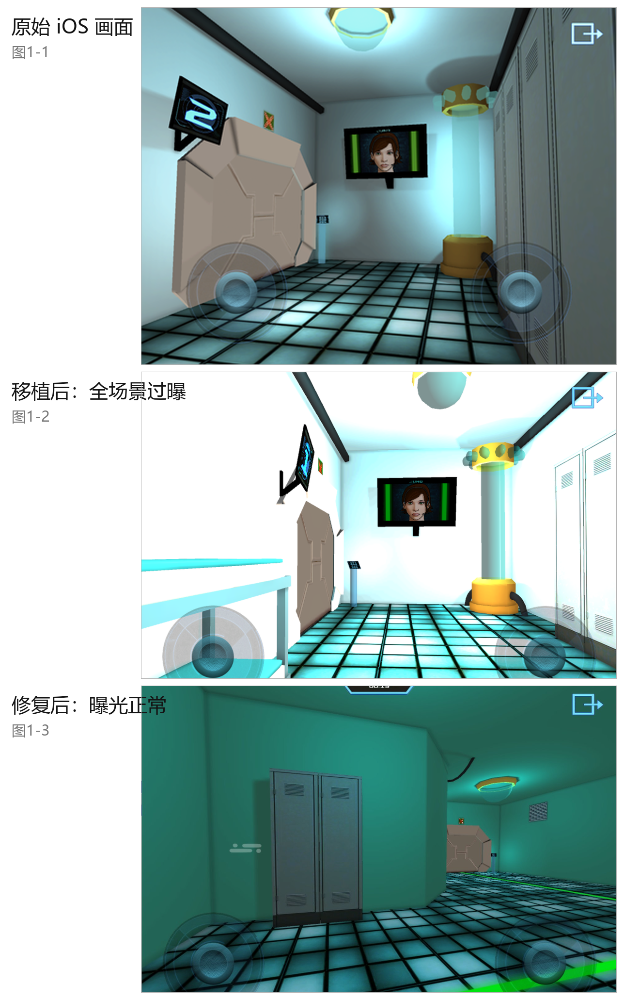

# 7HE CODE — Windows Revival

<a href="README.md">简体中文</a> ｜ <b>English</b>

Bringing a delisted iOS game back to life on Windows.

This repository ships a **complete, runnable Windows build**, together with the full record of how it was revived and every patch script used along the way.

---

## First credit: where the ipa came from (ipatool)

Everything here depends on **getting the original ipa** — and *7HE CODE* had long been pulled from the App Store, unbuyable and unsearchable.

That step was done with [ipatool](https://github.com/majd/ipatool) (v2.6.0):

1. `ipatool list-purchases` exported all **272 previously purchased apps** on the Apple ID, and an iTunes lookup check across **three storefronts (CN / US / JP)** narrowed it down to **77 apps delisted in all three**. For those, no account anywhere can obtain them from the store any more — the only remaining route is the existing purchase entitlement.
2. `ipatool download -i <app-id> --purchase` then uses exactly that entitlement to pull the ipa **while the app is delisted**.

*7HE CODE* is the **first case that proved this route works** — both ipa builds (v1.0, 65.6 MB; v2.0, 51.9 MB) came from it. Without it there would be no source data, and none of the engine-shell grafting, texture conversion or lightmap repair would have been possible.

> Notes for reproducing: `ipatool auth login -e <your Apple ID>` (password input is hidden; the 2FA code goes to your mailbox); `ipatool search` fails for delisted apps — that is expected, **download by numeric app-id** instead; if it answers "not owned", that account never bought the app and this route is closed.

---

## What this is

*7HE CODE* is an iOS game built with Unity 3.4.2 (Mono lineage). It was pulled from the App Store long ago and is no longer obtainable through any official channel — a textbook piece of lost media.

It was not revived by rebuilding the project, but by **grafting an engine shell**: a Windows standalone player of the same Unity version is used as the host, with the original iOS `Data/` folder dropped straight into it. Every platform mismatch that followed was then fixed one by one. The result is a program you can play by double-clicking.

| Item | Detail |
| --- | --- |
| Engine | Unity 3.4.2f3 (Mono / .NET 2.0 lineage) |
| Original platform | iOS (data files carry `target_platform = 9`) |
| Current platform | Windows standalone (`target_platform = 5`) |
| Architecture | 32-bit executable, runs on 32-bit and 64-bit Windows |
| Internal render resolution | 1440 × 960 virtual resolution |



<sub>The same room in three states: original iOS frame / overexposed after the graft / after the fix</sub>

---

## Run it in three steps

### 1. Get the repository

```bash
git clone https://github.com/Barry-Wuu/7HE-CODE-Win11-Revival.git
```

Or click **Code → Download ZIP** on this page.

### 2. Unpack the game archive

`7HE-CODE-PC-Revival.zip` in this repository is the complete game (about 27 MB compressed, roughly 190 MB unpacked).

Windows' built-in extractor works fine (right-click → Extract All). WinRAR and 7-Zip work too.

> Note: the raw `resources.assets` is 115 MB, above GitHub's 100 MB per-file limit, which is why the game ships as a compressed archive.

### 3. Double-click to play

Open the extracted `7HE-CODE-PC-Revival` folder and run **`Play 7HE CODE.bat`**.

A few seconds of black screen on first launch is normal (engine init plus asset loading).

---

## Controls

The original virtual joysticks have been turned into two parallel input paths — keyboard and mouse — that work independently and can be used at the same time.

| Action | Input |
| --- | --- |
| Move | `W` `A` `S` `D` or the arrow keys |
| Look around | Hold **right mouse button** and drag |
| Drag the left virtual joystick | Hold **left mouse button** on it |
| Drag the right virtual joystick | Hold **left mouse button** on it |
| Move and look at once | Hold `WASD` with the left hand while dragging with the right button on the right hand |
| Interact with scene hotspots | Left-click (you must stand on the right spot first) |

Movement stops **the moment you release the key** — there is no sliding momentum.

---

## System requirements

- Windows 7 SP1 / 8 / 10 / 11 (32-bit and 64-bit both fine)
- DirectX 9.0c runtime (built into Windows 10 / 11; older systems may need it installed)
- A GPU with DXT1 / DXT5 texture compression support — any discrete or integrated GPU from 2005 onward qualifies
- About 400 MB of free disk space (roughly 190 MB after extraction)

---

## What this version fixes

Getting from "the data loads" to "it looks like a normal PC game" took six rounds.

| # | Problem | Symptom | Fix |
| --- | --- | --- | --- |
| 1 | Platform stamp | Refuses to load assets built for another target | `target_platform` changed from 9 (iOS) to 5 (Windows standalone) in 12 of 13 data files |
| 2 | Missing built-in assets | Errors about `UnitySplash.png` / `Internal-GUITexture.shader` not found | Unity's default resources supplied in both `Resources\` and `library\` |
| 3 | Missing engine API | `MissingMethodException: iPhoneSettings.get_generation` | Reverted to the iOS `UnityEngine.dll` and stubbed 45 of its InternalCalls |
| 4 | Dead touch input | Menus render, but nothing responds to clicks | Gave `Input.get_touchCount`, `Touch.get_phase` and `Touch.get_position` proper semantics, mapping mouse input onto them |
| 5 | Garbled textures | Screen full of colored noise | All 237 PVRTC textures converted to desktop DXT1 / DXT5 |
| 6 | Global overexposure | Washed-out, bluish image; 62% of pixels blown out | Lightmaps re-encoded as RGBM (see below) |
| 7 | Unusable controls | Virtual joysticks unresponsive; no keyboard or mouse path | Keyboard/mouse support injected at the IL level; left and right joysticks judged independently |
| 8 | Post-stop jolt | The view drifts or snaps a little when stopping | First-person camera lean amplitude set to zero |

### Item 6 deserves its own explanation

Unity's built-in shaders decode lightmaps **differently per platform** (see `DecodeLightmap` in `CGIncludes/UnityCG.cginc`):

```hlsl
inline fixed3 DecodeLightmap( fixed4 color )
{
#if defined(SHADER_API_GLES) && defined(SHADER_API_MOBILE)
    return 2.0 * color.rgb;              // iOS: Double-LDR, ×2
#else
    return (8.0 * color.a) * color.rgb;  // Desktop D3D9: RGBM, alpha as multiplier, ×8
#endif
}
```

iOS lightmaps are alpha-less RGB24 / PVRTC_RGB4, stored with a ×2 scale. On desktop the missing alpha reads as 1.0, so the same data is decoded at **×8** — making the whole scene four times brighter than the original.

The fix: convert all 30 lightmaps to RGBA32, leave RGB untouched, and write the compensation factor into alpha so the desktop path's `8 × alpha` reproduces the iOS brightness exactly, with no loss of RGB precision. This build uses alpha = 92 (a factor of 2.886), chosen by comparing feature-by-feature against the original frame.

---

## Repository layout

```
7HE-CODE-PC-Revival/
├── README.md                     Simplified Chinese version
├── README.en.md                  This file
├── 7HE-CODE-PC-Revival.zip       Complete runnable game (unpack and play)
├── assets/                       Images used by the READMEs
├── docs/                         (in Chinese)
│   ├── 复活战役进度.md             Battle log of the whole revival, stage by stage
│   ├── 修复全记录.md               Technical write-up (same source as the Bilibili article)
│   └── 挖掘报告.md                 Early research on where the data came from
└── patches/
    ├── README.md                 What each script does and in what order to run them
    ├── il_internalcall_stub.py   .NET metadata / IL injection toolkit
    ├── unity3x_touch_mouse_shim.py  The three touch-API stubs
    ├── pc_pad_b.py               Keyboard/mouse control injection (including the dual-path split)
    ├── cam_nolean.py             First-person camera lean zeroed out
    └── lm_fix_global.py          Batch lightmap RGBM fix
```

---

## FAQ

**Black screen on launch, then it exits?**
Check `output_log.txt` in the game folder first. The two most common causes: an outdated GPU driver (no DXT support), or antivirus software blocking the old Unity player (it is a 2013-era binary and gets false-flagged fairly often).

**Textures are all colored noise?**
The texture conversion did not take effect, or files were overwritten. Use the original files from the archive; do not swap out the `.assets` files under `7HECODE_Data` yourself.

**The whole screen is blinding white or cyan?**
That is the lightmap decoding issue. This repository's build already fixes it — if you see it, you are almost certainly running unpatched data.

**The virtual joysticks do not respond / the keyboard does nothing?**
Make sure you are running the build from this repository's archive. With the raw iOS data dropped into the shell, the joysticks do not respond at all.

**How do I change mouse sensitivity?**
Edit the `GAIN` constant at the top of `patches/pc_pad_b.py` (default 2.0) and re-inject.

**The in-game buttons and menus look offset?**
The game lays out its GUI against a 1440 × 960 virtual resolution. In fullscreen or very large windows the GUI scales accordingly — that is expected.

---

## Reproducing the whole thing yourself

The scripts under `patches/` are reusable, but they **must be run in order** — each one builds on the previous one's output:

```bash
python il_internalcall_stub.py         # toolkit
python unity3x_touch_mouse_shim.py     # the three touch stubs
python pc_pad_b.py --apply             # inject keyboard/mouse control (rebuilds from the pristine DLL)
python cam_nolean.py --apply           # zero the camera lean (must come after the previous step)
python lm_fix_global.py --alpha 0.36 --apply   # lightmap RGBM fix
```

Two things to note:

- `pc_pad_b.py` rebuilds the assembly from a **pristine, unmodified DLL** (PE section expansion cannot be stacked), so it overwrites any other change made to that same DLL — `cam_nolean.py` must be re-run after it.
- The paths hardcoded in these scripts point to the original author's machine. Change them to match yours.

To verify without launching the game: load the patched assembly with the same generation of Mono and force a JIT pass. See `docs/复活战役进度.md` (in Chinese).

---

## Provenance and disclaimer

- The original data came from the `Payload/7HE CODE.app/Data/` folder of the retail iOS app. This repository does **not** distribute the original ipa.
- This repository exists for **lost-media preservation and research**. The game has been removed from every official channel, and its store page and official interfaces are all dead.
- All rights to the game itself belong to its original author and rights holders. This repository claims no rights over the game content. It is provided for study, research and personal archival use only — **commercial use is prohibited**.
- If a rights holder objects to this repository, please get in touch and it will be taken down immediately.

This repository is hosted at two addresses with identical content — use whichever one is reachable:

- <https://github.com/Barry-Wuu/7HE-CODE-Win11-Revival> (GitHub)
- <https://gitcode.com/Barry_Wu_/7HE-CODE-Win11-Revival> (GitCode, direct access from mainland China)

## Tools used

[UnityPy](https://github.com/K0lb3/UnityPy) (with a Unity 3.4 / format v8 compatibility patch), [texture2ddecoder](https://github.com/K0lb3/texture2ddecoder), [AssetRipper](https://github.com/AssetRipper/AssetRipper), and the Mono 2.0 runtime plus `gmcs` bundled with Unity 3.4.2.

---

<sub>The written record of this revival is also published as a Bilibili article; see the repository homepage for the link.</sub>
